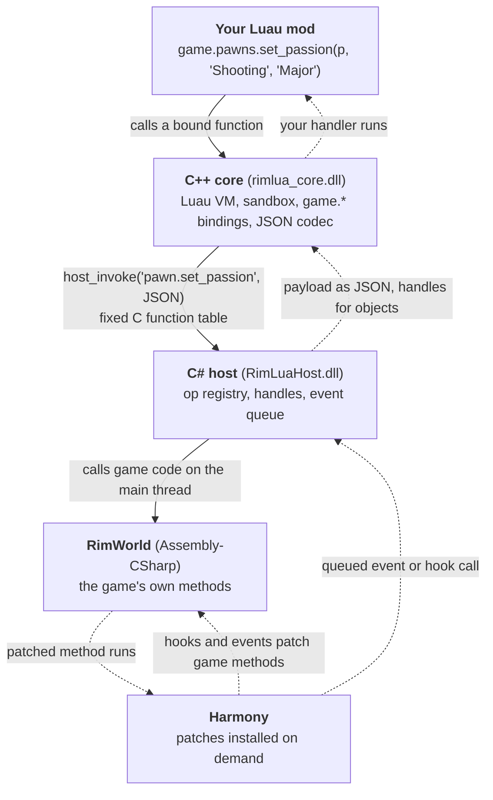
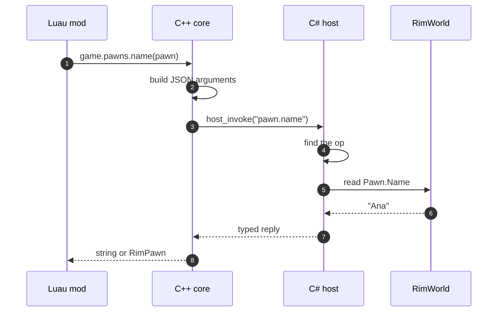
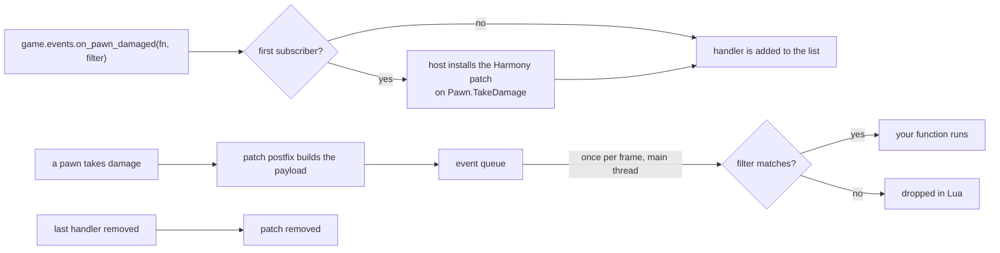

# Architecture

How a line of Lua reaches RimWorld, and what to know when something goes wrong.

Solid arrows are a call you make. Dotted arrows are the game calling you back through a hook or an event.

## The pieces

| Piece | Where | Job |
|-------|-------|-----|
| Lua core | `src/native/core` | Runs one sandboxed Lua state. Binds the `game.*` API. Parses and builds JSON for the host |
| Host | `src/host` | Registers named operations (`pawn.name`, `reflect.get`, ...). Owns object handles. Installs Harmony patches. Queues events |
| Registry | `src/host/api/ApiRegistry.cs` | Maps operation names to handlers. Unknown names fail |
| Event catalog | `src/host/EventCatalog.cs` | Named events, each patched on first subscription |
| CLI | `src/native/cli` | `rimkit` commands: create, sync, ship, check, test, build |

## One call, step by step

1. Lua calls a bound function. The core builds a small JSON object of arguments.
2. The core calls the host through a fixed C function table (`rimlua_abi.h`).
3. The host looks the operation up in the registry and runs the handler on the game's thread.
4. The handler returns a typed JSON reply. Scalars come back as scalars, structured data as a table, and game objects as handles.
5. The core decodes the reply into Lua values. A handle becomes a wrapped object such as `RimPawn`.

## Handles

Lua never holds a game object. It holds an integer handle that the host maps to the real object. The core wraps handles as `RimPawn`, `RimThing`, `RimMap`, `RimFaction`, `RimEntity`, and `RimObject` for anything else.

- A handle stays valid until a game is loaded or started, which clears them all. After that `RK2001` (stale handle) is raised or `nil` is returned.
- Handles hold the object alive. Use `game.reflect.release(obj)` to free one early.
- Never save a handle. Save a stable id or use a Def, and look the object up again.

## Hooks and events

A hook (`game.hooks.*`) is a Harmony patch on a game method that calls your Lua function. One patch per method is shared by every hook on it and removed when the last one goes. A hook runs on whichever thread runs the patched method.

A named event (`events.on`) is a catalog entry: a patch the host installs only while someone is subscribed. Events are queued and delivered to Lua on the main thread once per frame, so handlers never run mid-game-code. See [events](../api/events.md).

## Threading

Lua is single threaded. Every entry into the Lua core takes one lock, so a hook that fires on a worker thread waits its turn. Keep hook bodies short. A hook that calls back into game code is limited to eight nested levels.

## Errors

Operations return success or a stable error code (`RK1001` to `RK5001`, see [RKS](../standard/rks.md)). Typed kits and `game.reflect` raise Lua errors starting with the code. A few plain handle functions log `host error` and return `nil`. An error inside a hook is logged and the game continues with its original behavior.

## Saving

RimKit stores per-mod data (`game.data`) in a game component, so it is saved with the colony. Control state for recruited pawns is stored the same way and restored on load. Anything else that a save needs to refer to must be an XML Def.

## Stability and naming

- Naming rules: [naming](../api/naming.md).
- Which names can change: [stability](../api/stability.md).
- The rules behind both: [the RimKit Standard](../standard/rks.md).
- What the game offers to hook: [game inventory](game-inventory.md).
