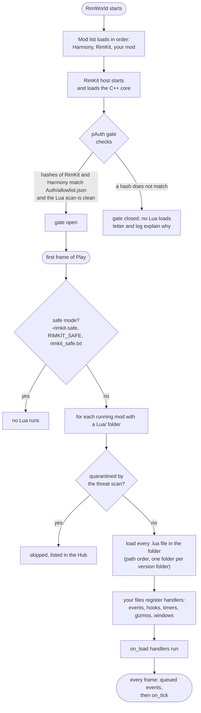
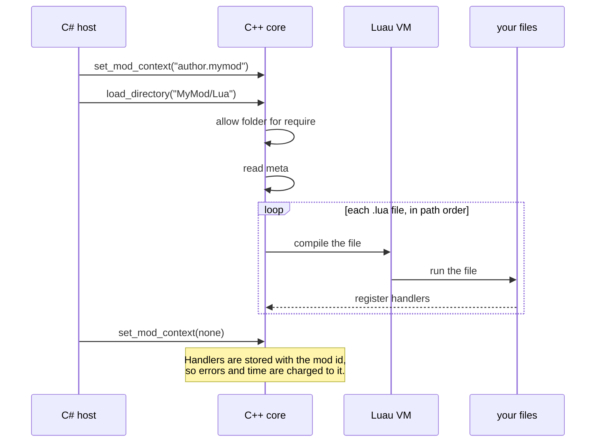
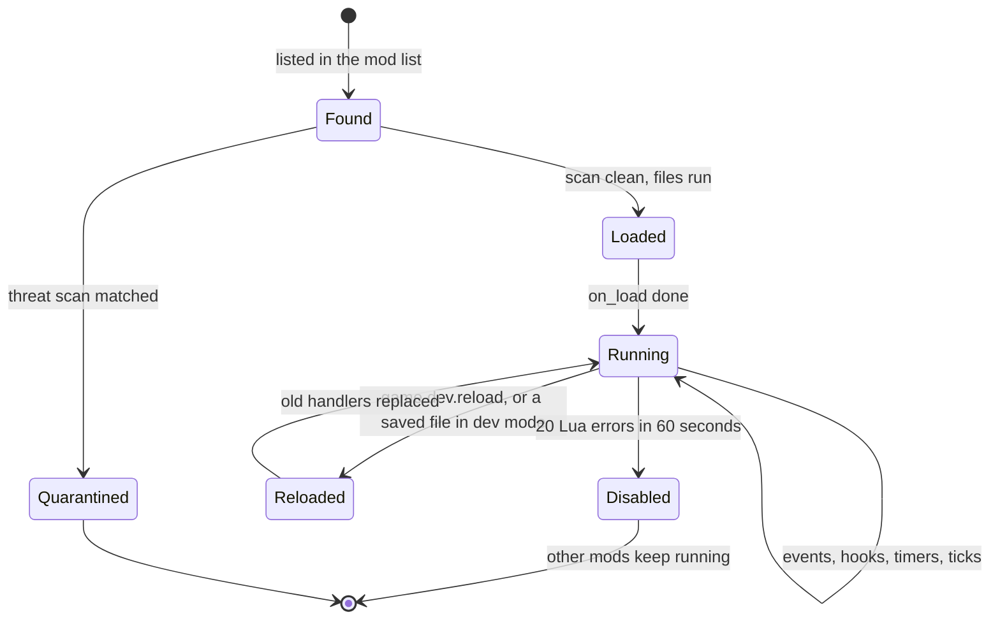
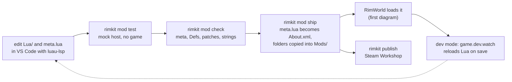

# How RimKit loads your mod

What happens between pressing Play and your first line of Lua running, and what keeps a broken mod from taking the game down. Use it to find out why a mod did not load.

## From the mod list to your code

The gate is a check of RimKit's own files, not of your mod. A scan of your Lua for forbidden calls (`load`, `dofile`, `os`, `io`) is separate: a mod that fails it is quarantined and the other mods still load.

## What loading a mod does

## What a mod can be

A disabled mod gets a letter that offers to turn it off for good. Fix the errors in the log and restart to run it again.

## From your editor to the game

## If your mod did not load

| What you see | Look at |
|--------------|---------|
| `LUA BLOCKED by builtin pAuth` | The gate is closed: reinstall RimKit, or run `node infrastructure/tools/release.js` after a rebuild |
| `Quarantined Lua skipped: <id>` | The threat scan matched your Lua. The log line names the file and rule |
| `Loading Lua from <id>` and then an error line | A runtime or syntax error in one of your files. The line number is the line in your file |
| Nothing at all for your mod | No `Lua/` folder, the mod is not enabled, or safe mode is on |
| `mod <id> was switched off after 20 Lua errors` | Fix the errors above that line and restart |

More in [troubleshooting](troubleshooting.md) and [architecture](../concepts/architecture.md).
