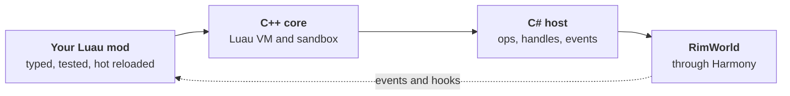

<div class="hero">
<p class="hero__eyebrow">RimWorld 1.6 · Luau · Harmony</p>
<h1 class="hero__title">Write RimWorld mods in <span>Luau</span></h1>
<p class="hero__lead">RimKit loads your scripts, gives them a safe and documented API to the game, and lets them hook any game method when the API does not cover something yet. Types, hot reload and tests without launching RimWorld.</p>
<div class="hero__actions"><a class="btn btn--primary" href="guide/quickstart.md">Build your first mod</a><a class="btn" href="api/reference.md">API reference</a><a class="btn" href="guide/how-mods-load.md">How it works</a></div>
</div>

<div class="stats">
<div class="stat"><span class="stat__num">105</span><span class="stat__label">kits (pawns, things, maps, factions and more)</span></div>
<div class="stat"><span class="stat__num">571</span><span class="stat__label">typed API functions</span></div>
<div class="stat"><span class="stat__num">116</span><span class="stat__label">named game events</span></div>
<div class="stat"><span class="stat__num">434</span><span class="stat__label">in-game checks passing on Luau</span></div>
</div>

## A mod in a few lines

=== "Events"

    ```lua
    -- Floating damage numbers above people. Red for colonists, orange for everyone else.
    game.events.on_pawn_damaged(function(pawn, e)
      game.effects.text(pawn, tostring(math.floor(e.dealt)), pawn.is_colonist and "red" or "orange")
    end, { humanlike = true, min_dealt = 1 })
    ```

=== "Hooks"

    ```lua
    -- Colonists never lose accuracy with distance.
    game.hooks.postfix("Verse.ShotReport", "HitFactorFromShooter", function(ctx)
      ctx:set_result(1)
    end)
    ```

=== "Things"

    ```lua
    -- Things are objects: read, assign and call.
    local steel = game.things.spawn_at("Steel", map, 12, 30, { count = 75 })
    steel.stack += 25
    if steel.hp < steel.max_hp then steel:heal() end
    ```

## Why RimKit

<div class="cards">
<a class="card" href="guide/luau.md"><span class="card__tag">Language</span><span class="card__title">Real Luau</span><span class="card__text">A typed dialect of Lua: types, continue, += and if-expressions. The editor completes every payload, and a typo is an error before you start the game.</span></a>
<a class="card" href="guide/security.md"><span class="card__tag">Safety</span><span class="card__title">Sandboxed by default</span><span class="card__text">No files, no processes, no network. A scan quarantines a hostile mod while the rest keep running, and a mod that raises too many errors is switched off.</span></a>
<a class="card" href="api/reference.md"><span class="card__tag">API</span><span class="card__title">Documented and typed</span><span class="card__text">Every function has a signature, a description and an example. Click a row in the reference to see how it works.</span></a>
<a class="card" href="api/hooks.md"><span class="card__tag">Reach</span><span class="card__title">Hook any game method</span><span class="card__text">When a kit does not cover something, patch the game method itself with a prefix, postfix or finalizer, or read any object through typed reflection.</span></a>
<a class="card" href="guide/testing.md"><span class="card__tag">Quality</span><span class="card__title">Test without the game</span><span class="card__text">rimkit mod test runs your tests against a mock host in a second. Mock what the game would say, call your code, check the result.</span></a>
<a class="card" href="api/dev.md"><span class="card__tag">Speed</span><span class="card__title">Hot reload and dev tools</span><span class="card__text">Save a file and the running game reloads your Lua. An in-game window shows hook cost, an event recorder and a profiler.</span></a>
</div>

## How it works



The full picture, with how a mod is found, checked and loaded, is in [how RimKit loads your mod](guide/how-mods-load.md) and the [architecture](concepts/architecture.md).

## Start here

<div class="cards">
<a class="card" href="guide/quickstart.md"><span class="card__tag">Ten minutes</span><span class="card__title">Quickstart</span><span class="card__text">Create, test and ship your first mod.</span></a>
<a class="card" href="guide/tutorials.md"><span class="card__tag">Learn</span><span class="card__title">Tutorials</span><span class="card__text">Seven step by step mods, from a message to a custom need.</span></a>
<a class="card" href="guide/cookbook.md"><span class="card__tag">Recipes</span><span class="card__title">Cookbook</span><span class="card__text">One working recipe for every mod idea.</span></a>
<a class="card" href="api/events.md"><span class="card__tag">React</span><span class="card__title">Events</span><span class="card__text">116 named events with filters and typed payloads.</span></a>
<a class="card" href="api/pawns.md"><span class="card__tag">Colony</span><span class="card__title">Pawns kit</span><span class="card__text">Skills, traits, needs, thoughts, health and gear.</span></a>
<a class="card" href="guide/troubleshooting.md"><span class="card__tag">Stuck</span><span class="card__title">Troubleshooting</span><span class="card__text">What a log line means and what to do about it.</span></a>
</div>

## What you can and cannot build

You can build most mods that are game logic: reacting to events, changing numbers and behavior, pawn data, right-click menus, windows and panels, hotkeys, settings, saved data, plus any XML Defs, patches and translations shipped next to the Luau.

You cannot yet replace the game renderer or use every planned kit. The full gap list, in phases, is in [what is missing](missing.md).

## Status

RimKit is pre-1.0. Every function has a stability tier ([stability](api/stability.md)). Stable names will not break before 1.0. Experimental names can change in a minor version. Targets RimWorld 1.6 with Harmony.

## Documentation map

- **API**: [overview](api/overview.md), [reference](api/reference.md), [events](api/events.md), [hooks](api/hooks.md), [pawns](api/pawns.md), [anomaly](api/anomaly.md), [reflect](api/reflect.md), [kits and domains](api/domains.md), [naming](api/naming.md), [stability](api/stability.md)
- **Concepts**: [architecture](concepts/architecture.md), [game inventory](concepts/game-inventory.md), [the RimKit Standard](standard/rks.md)
- **Project**: [what is missing](missing.md), [mod ideas](mod-ideas.md)
